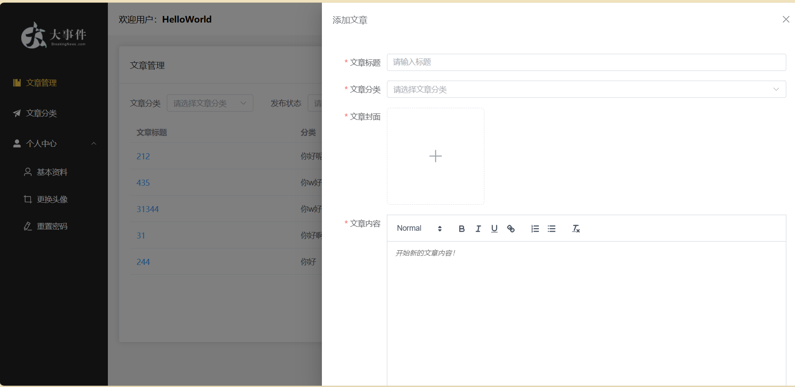
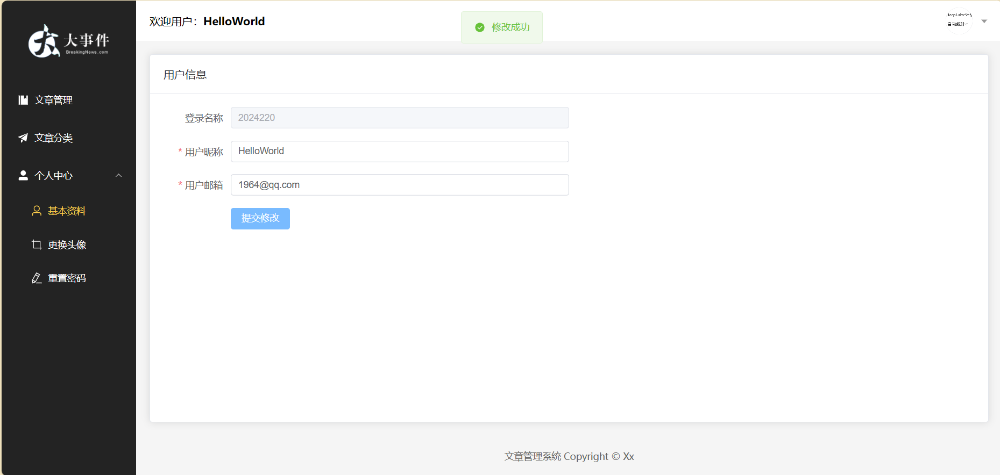

# 初始化
1. 使用 pnpm 管理依赖
```bash
npm install -g pnpm
```
2. 安装 package.json 中的依赖
```bash
pnpm install
```
3. 启动项目
```bash
pnpm dev
```
4. 打包
```bash
pnpm run build
```

# 技术栈
- TypeScript
- Vue Router：管理路由
- Pinia：管理数据
- ESLint：使代码规范
- Prettier 使代码美观
- husky：git hooks 工具，往远程仓库提交内容前，触发钩子检查代码。默认全量检查（耗时问题、其他开发者的历史遗留问题）。并添加了 lint-staged 仅检查暂存区新添加的代码
- sass：预处理样式
# 界面截图
- 登录

- 文章添加

- 用户信息


# 教程
[接口文档](https://apifox.com/apidoc/shared-26c67aee-0233-4d23-aab7-08448fdf95ff/api-93850835)

[学习视频](https://www.bilibili.com/video/BV1HV4y1a7n4)